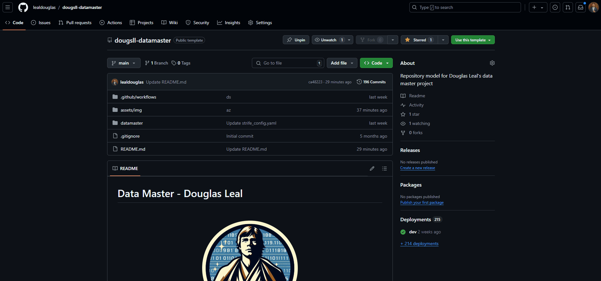
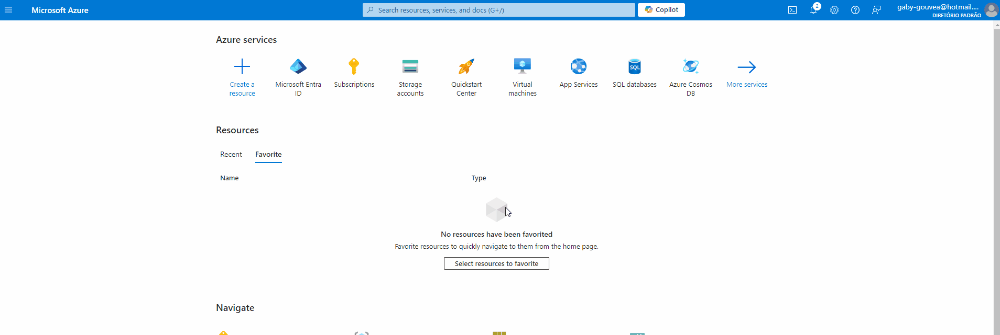
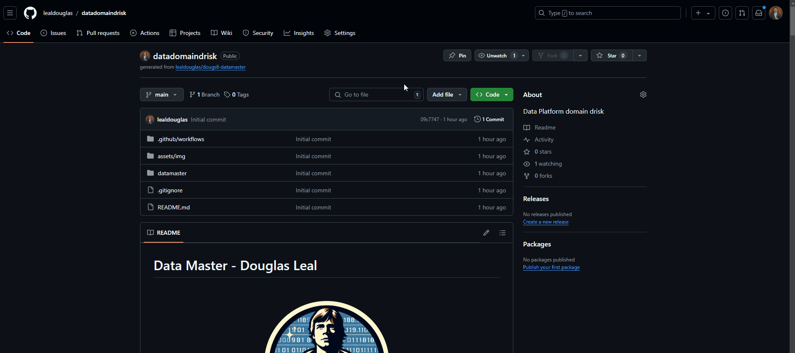
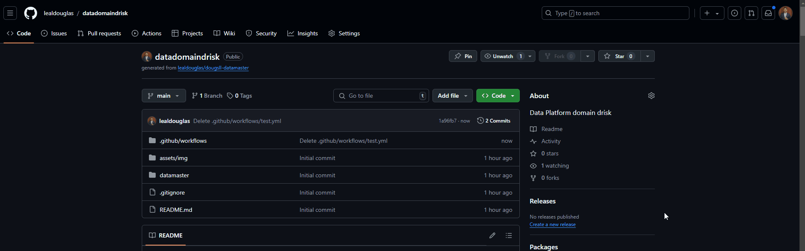
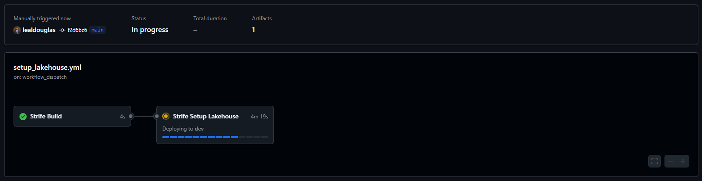
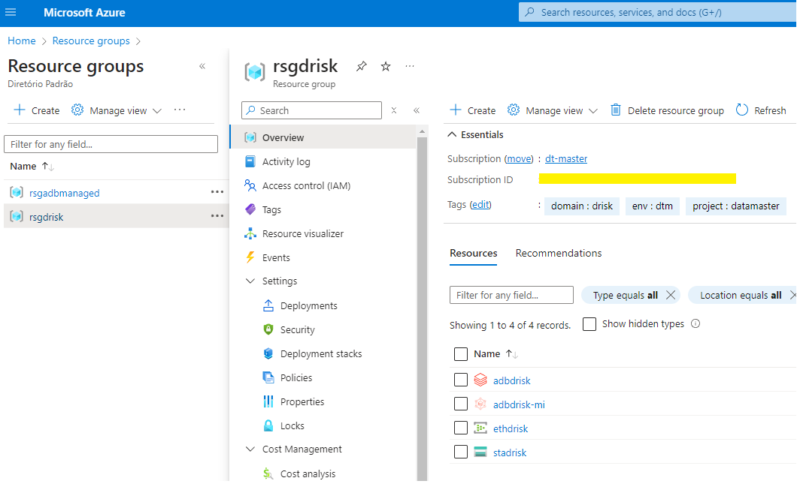
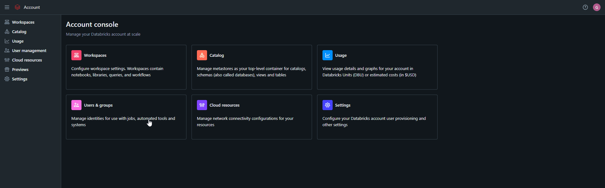
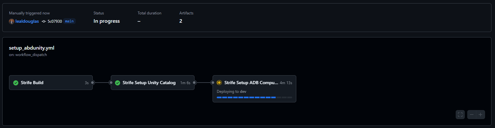

# Strife Terraform

## Introdução

Bem-vindo à documentação do Strife, Terraform que implanta recursos necessários para explorar um ambiente de plataforma de dados na azure, no qual tem como objetivo entregar uma plataforma de dados simplificada para uso eficiente.

Esse projeto foi elaborado para o projeto [Data Master Douglas Leal](https://carlton.readthedocs.io/pt-br/latest/03_projeto/), onde Strife é utilizado como [script padrão para setup do ambiente](https://carlton.readthedocs.io/pt-br/latest/03_projeto/#33-ideacao-do-projeto).

Este repositório contém o seguinte:

1. [Introdução](#introdução)
2. [Objetivo do Case](#1-objetivo-do-case)
3. [Casos de Uso](#2-casos-de-uso)
4. [Estrutura do Repositório](#3-estrutura-do-repositório)
5. [Funcionalidades Principais](#4-funcionalidades-principais)
6. [Usando o Repositório](#5-usando-repositório)
7. [Instruções para Configuração e Execução do Projeto](#6-instruções-para-configuração-e-execução-do-projeto)
   - [Pré-requisitos](#61-pré-requisitos)
   - [Passos de Configuração](#62-passos-de-configuração)
     - [Step 1. Utilize o repos template](#step-1-utilize-o-repos-template)
     - [Step 2. Configure arquivo de Setup Infraestrutura Lakehouse](#step-2-configure-arquivo-de-setup-infraestrutura-lakehouse)
     - [Step 3. Configure usuário de serviço (Service Principal)](#step-3-configure-usuário-de-serviço-service-principal)
     - [Step 4. Configure as secrets no GIT](#step-4-configure-as-secrets-no-git)
     - [Step 5. Execute a action Strife Lakehouse](#step-5-execute-a-action-strife-lakehouse)
     - [Step 6. Recupere Account ID do Unity Catalog e habilite Account Admin](#step-6-recupere-account-id-do-unity-catalog-e-habilite-account-admin)
     - [Step 7. Execute a action Strife ADB Unity Catalog](#step-7-execute-a-action-strife-adb-unity-catalog)

&nbsp;

## 1. Objetivo do Case

Este projeto visa desenvolver uma solução de engenharia de dados com o principal objetivo de preparar um ambiente para estudo e exploração de dados baseado em nuvem em poucos minutos. O projeto simula a criação de um ambiente conceitual de dados para um domínio de dados, configurando o ambiente para realizar ações como pipelines de ingestão e exploração de dados. Strife é responsável por entregar esse ambiente pronto para exploração e uso.

## 2. Casos de Uso

A solução é projetada para preparar um ambiente de estudo e exploração de dados baseado em nuvem em poucos minutos. Considere o seguinte cenário: Eu, como engenheiro de dados e/ou ML, a partir de uma subscrição demoninada como "domínio de dados riscos (drisc)" preciso montar o setup do meu ambiente cloud e criar o pipeline de dados, desde a ingestão até a construção de uma smart table. Nesse cenário, preciso considerar a configuração de um ambiente governado, baseado em uma arquitetura medalhão, explorar dados e implantar um motor. A solução deve permitir ao desenvolvedor configurar seu ambiente, simulando uma prateleira de recursos para dados, e, com poucas configurações, definir um fluxo de ingestão e entregar um ambiente para exploração de dados, integrado à jornada de implantação. Toda a jornada apresentada em um só lugar, de maneira básica e bem feita.

## 3. Estrutura do repositório<a id="estrutura"></a>

Este documento descreve a estrutura de pastas do projeto e a finalidade de cada diretório e arquivo. O objetivo é fornecer uma visão geral clara e organizada do projeto para facilitar a navegação e a compreensão.

### 3.1 Estrutura de Pastas

```plaintext
.
├── lakehouse
│   ├── main.tf
│   ├── variables.tf
│   ├── outputs.tf
│   └── modules
│       ├── azure-aad-users
│       │   ├── main.tf
│       │   ├── variables.tf
│       │   └── outputs.tf
├── azureadb-uc
│   ├── main.tf
│   ├── variables.tf
│   ├── outputs.tf
│   └── modules
│       ├── metastore
│       │   ├── main.tf
│       │   ├── variables.tf
│       │   └── outputs.tf
│       ├── external-object
│       │   ├── main.tf
│       │   ├── variables.tf
│       │   └── outputs.tf
├── cicd-pipelines
│   ├── .github
│   │   └── workflows
│   │       ├── lakehouse.yml
│   │       └── azureadb-uc.yml
└── README.md
```

### 3.2 Descrição das Pastas e Arquivos

1. `lakehouse/`
   Este diretório contém os arquivos principais para a configuração do ambiente de exploração de dados na Azure.

- main.tf: Arquivo principal do Terraform que define os recursos a serem criados.
- variables.tf: Define as variáveis usadas no main.tf.
- outputs.tf: Define as saídas dos recursos criados.

  1.1. `lakehouse/modules/azure-aad-users/`
  Este subdiretório contém módulos para a criação de usuários e grupos no Azure Active Directory (AAD).

- main.tf: Arquivo principal do módulo que define os recursos AAD.
- variables.tf: Define as variáveis usadas no módulo.
- outputs.tf: Define as saídas dos recursos criados pelo módulo.

2. `azureadb-uc/`
   Este diretório contém os arquivos principais para a configuração do Unity Catalog e a sincronização dos usuários AAD com a conta Databricks.

- main.tf: Arquivo principal do Terraform que define os recursos a serem criados.
- variables.tf: Define as variáveis usadas no main.tf.
- outputs.tf: Define as saídas dos recursos criados.

  2.2. `azureadb-uc/modules/metastore/`
  Este subdiretório contém módulos para a configuração do metastore do Unity Catalog.

- main.tf: Arquivo principal do módulo que define os recursos do metastore.
- variables.tf: Define as variáveis usadas no módulo.
- outputs.tf: Define as saídas dos recursos criados pelo módulo.

  2.3. `azureadb-uc/modules/external-object/`
  Este subdiretório contém módulos para a configuração de objetos externos no Unity Catalog.

- main.tf: Arquivo principal do módulo que define os recursos externos.
- variables.tf: Define as variáveis usadas no módulo.
- outputs.tf: Define as saídas dos recursos criados pelo módulo.

3. `cicd-pipelines/`
   Este diretório contém os arquivos de configuração para pipelines de CI/CD usando GitHub Actions.

4. `.github/workflows/`
   Este subdiretório contém os arquivos de workflow do GitHub Actions.

- lakehouse.yml: Define o pipeline de CI/CD para o diretório lakehouse.
- azureadb-uc.yml: Define o pipeline de CI/CD para o diretório azureadb-uc.

## 4. Funcionalidades Principais

Esse script entrega,

- **Resource Group** - Grupo de recurso do projeto
- **Storage account Gen2** - Storage account para gestão do metastore, raw, e medalhão containers.
- **Workspace Databricks** - Workspace para explorar os dados e ambiente.
- **Account Databricks** - unity catalog e usuarios sincronizados na workspace.
- **Metastore Databricks** - Metastore para gestao do unity catalog associado com a workspace criada.

## 5. Usando repositório<a id="iniciorapido"></a>

Existem duas maneiras de usar este repositório:

- Use repos template final [dougsll-datamaster](https://github.com/lealdouglas/dougsll-datamaster), no qual utiliza desse repositório para criar o ambiente exploratório.
- Reutilize módulos deste repositório como referência para seu projeto individual.

## 5. Instruções para Configuração e Execução do Projeto

### 5.1 Pré-requisitos

- Conta na Azure
- Subscrição Azure, preferência sem uso.
- Usuário de serviço (Service Principal), conforme [Step 3 - Configure usuário](https://github.com/lealdouglas/dougsll-datamaster?tab=readme-ov-file#step-3-configure-usu%C3%A1rio-de-servi%C3%A7o-service-principal) com as seguintes atribuições:
  - **Owner**, para criar e gerenciar recursos da azure.
  - **Global Administrator**, para sincronizar grupos e usuários do AAD no unity.
  - **Account Admin**, após provisionar ambiente [Step 5 - Setup Lakehouse](https://github.com/lealdouglas/dougsll-datamaster?tab=readme-ov-file#step-5-execute-a-action-strife-lakehouse), para configurar Unity Catalog.
- Definição das variaveis de ambiente:
  - **TF_ARM_TENANT_ID**, conta na azure (tenant)
  - **TF_ARM_SUBSCRIPTION_ID**, subscrição da conta
  - **TF_ARM_CLIENT_ID**, ID do usuário de serviço com permissão para criar recursos e grupos.
  - **TF_ARM_CLIENT_SECRET**, Secret do usuário de serviço com permissão para criar recursos e grupos no AAD.
  - **ADB_ACCOUNT_ID**, ID da console Unity Catalog do Databricks, saiba mais em [Step 6 - Recupere Account ID](https://github.com/lealdouglas/dougsll-datamaster?tab=readme-ov-file#step-6-recupere-account-id-do-unity-catalog-e-habilite-account-admin)

> [!NOTE]
> Não é possível automatizar a captura do account_id via terraform, por isso, no step 6 apresentamos como recuperar manualmente.

Utilize o tópico [Passos de Configuração](#42-passos-de-configuração) para dar sequência ao seu projeto.

Consulte [como configurar service principal](#configserviceprincipal) para criar seu usuário de aplicacao.

### 4.2 Passos de Configuração

#### Step 1. Utilize o repos template

A partir desse repos template, crie um novo para seu projeto.

- Clique em **Use this template** que está ao topo da tela desse repositório.
- Selecione **Create a new repository**
- Defina um nome para seu projeto
- Conclua em **Create repository**

<p align="center">
  
</p>

#### Step 2. Configure arquivo de Setup Infraestrutura Lakehouse

Altere os valores para o qual deseja criar os nomes dos recursos e catálogo

- No repos, acesse **datamaster/strife_env/strife_config.yaml**
  ```yaml
  domain: risk #nome do domínio
  catalog: risk #nome do catálogo
  project: datamaster #nome do projeto
  ```

#### Step 3. Configure usuário de serviço (Service Principal)

Crie um usuário de serviço na Azure (Service Principal) com as seguintes atribuições,

- **Owner**, para criar e gerenciar recursos da azure.
  Para configurar um usuário de serviço, você pode fazer via power shell ou via [azure cli](https://learn.microsoft.com/pt-br/cli/azure/install-azure-cli), após acessar o terminal, utilize o comando abaixo para criar o usuário:

  ```sh
  az login
  az ad sp create-for-rbac -n spndatamasteradmin --role Owner --scopes /subscriptions/<SUBSCRIPTION_ID>
  ```

  Onde,

  - **SUBSCRIPTION_ID** é o ID da subscrição da sua conta Azure.
  - O usuário de serviço **spndatamasteradmin** deve ser criado e as variáveis **password** (`TF_ARM_CLIENT_SECRET`) e **appId** (`TF_ARM_CLIENT_ID`) serão exibidas, as utilize-as para [configurar as secrets no git](https://github.com/lealdouglas/dougsll-datamaster?tab=readme-ov-file#step-3-configure-as-secrets-no-git).

- **Global Administrator**, para sincronizar grupos e usuários do AAD no unity.
  Após criar usuário, acesse ao recurso da conta, Microsoft Entra ID, para incluir o usuário a permissão de Global Administrator,

  - Selecione o recurso **Microsoft Entra ID**, o Diretório Padrão (Active Directory)
  - Selecione no canto esquerdo, **Roles and administrators**
  - Busque por **"Global Administrator"**
  - Clique em **Add assignments**
  - Busque pelo seu **usuário de serviço** (SPN)
  - Clique em **add**

<p align="center">
  
</p>

#### Step 4. Configure as secrets no GIT

Configure as variaveis de ambiente (secrets) em seu repositório Git,
Para configurar as variáveis, acesse: [Crie secrets para um repositório](https://docs.github.com/pt/actions/security-for-github-actions/security-guides/using-secrets-in-github-actions#creating-secrets-for-a-repository)

- **TF_ARM_TENANT_ID**, conta na azure (tenant)
- **TF_ARM_SUBSCRIPTION_ID**, subscrição da conta
- **TF_ARM_CLIENT_ID**, ID do usuário de serviço com permissão para criar recursos e grupos no AAD.
- **TF_ARM_CLIENT_SECRET**, Secret do usuário de serviço com permissão para criar recursos e grupos no AAD.
- **ADB_ACCOUNT_ID**, ID da console Unity Catalog do Databricks.

<p align="center">
  
</p>

<p align="center">
  
</p>

#### Step 5. Execute a action Strife Lakehouse

- Na tela inicial do repos, clique em **Actions**
- Selecione **01. Strife - Setup Lakehouse**
- Clique no botão a direita, **Run workflow**

<p align="center">
  
</p>

<p align="center">
  
</p>

Após execução, os recursos abaixo serão criados

<p align="center">
  
</p>

> [!Note]
> Um container chamado ctrd`risk`raw será criado para arquivos brutos de ingestão.

> [!WARNING]
> Atenção, importante desabilitar o recurso Network Watcher que tem como objetivo monitorar e gerenciar serviços da sua conta. Para esse projeto não há necessidade. Saiba mais em [ativar_desativar_network_watcher](https://learn.microsoft.com/en-us/azure/network-watcher/network-watcher-create?wt.mc_id=knwlserapi_inproduct_azportal&tabs=portal#disable-network-watcher-for-your-region) e [desative gerenciamento automático](https://learn.microsoft.com/en-us/azure/network-watcher/network-watcher-create?wt.mc_id=knwlserapi_inproduct_azportal&tabs=cli#opt-out-of-network-watcher-automatic-enablement).

#### Step 6. Recupere Account ID do Unity Catalog e habilite Account Admin

Para dar sequencia ao setup, é necessário capturar qual account_id está vinculado ao console do unity catalog, infelizmente não é possível automatizar essa captura via terraform.

- Acesse account console, [accounts.azuredatabricks.net/login](https://accounts.azuredatabricks.net/login/).
- Após copiar account_id no canto superior direito da tela do account, cadastre a secret **ADB_ACCOUNT_ID**.

> [!IMPORTANT]
> Caso sua conta principal não esteja conseguindo logar no account console, utilize o login do campo **User principal name** que encontra-se no perfil da sua conta no AAD.

<p align="center">
  
</p>

> [!NOTE]
> Caso já exista um metastore cadastrado como default, **delete** para que seja feito um a partir desse projeto.

Em seguida, **é importante marcar o usuário de serviço como account_admin**, para que tenha permissão de criar catálogo, metastore, external metastore, schema, tables e outros:

- Clique em **User management** no menu lateral
- Clique na aba **Service principals**
- Selecione seu **service principal pelo id**
- Clique na aba **Roles**
- Habilite a opção **account Admin**
- Faça o mesmo para sua conta principal.

#### Step 7. Execute a action Strife ADB Unity Catalog

- Na tela inicial do repos, clique em **Actions**
- Selecione **02. Strife - Setup Unity Lakehouse**
- Clique no botão a direita, **Run workflow**

<p align="center">
  
</p>

Nessa action, será configurado:

- **Metastore**, chamado primary.
- **Storage Credentials**, para seu metastore e catálogo.
- **External Locations**, para seu metastore e catálogo.
- **Sincronização**, de usuários e grupos do AAD para account e workspace.
- **Cluster single user**, chamado cluster-single-dtm-`DOMAIN`, com autoterminate de 10min, uso ao service principal.
- **Setup do cluster**, mínimo utilizado para esse projeto: _1 Driver; 8 GB Memory, 4 Cores; Runtime 14.3.x-scala2.12_
- **Catálogo**, chamado c`CATALOG`
- **Schemas**, bronze, silver e gold.
- **Permissões**, acesso ao grupo data_engineer aos schemas listados acima.

> [!NOTE]
> Caso não consiga enxergar o catálogo criado, adicione sua conta principal ao grupo **data_engineer** a nível de console e aguarde alguns segundos.

```

```
